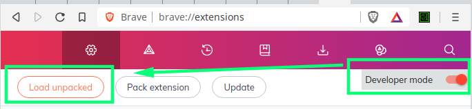

# Open Cookie Editor

## A chromium cookie editor you can trust
I don't trust many extensions which can read/write sensitive data from the browser, so I decided to write my own and opensource the code. The codebase is intentionally small, offering a minimalist cookie editor which can be source-code reviewed in a few minutes.

## Some (hopefully) useful features
- edit/delete all aspects of existing cookies
- create new cookies
- base64 & url encode/decode helpers
- smart search+filter within domain scope

## Get it from the extensions store (or just install yourself)
If you're extra paranoid about supply-chain attacks, review the code here, clone, and install as an unpacked extension locally

